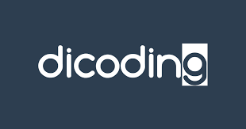
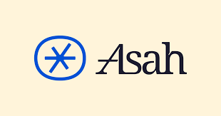

<h1 align="center">🔥 Progress Belajar Dicoding Asah 🔥</h1>

  
  

  <i>Perjalanan belajarku di program Dicoding Asah x Accenture </i>

---

  <!-- Bahasa & Tools -->
  
  
  
  
  

  ---

  
 
 

---

## Tentang Program
**Dicoding Asah** adalah program intensif hasil kolaborasi Dicoding x Accenture.  
Fokus utama: membekali mahasiswa dengan skill digital biar siap masuk dunia kerja.  

Repo ini aku bikin buat nyimpan:
- Hasil praktek & latihan
- Progress belajar dari awal sampai akhir  

---
## Progres Belajar
| Modul | Topik Utama                                         | Status       |
| ----- | ------------------------------------------------------------ | --- | 
| 1     | Memulai Dasar Pemrograman untuk Menjadi Pengembang Software  |  ✅ | 
| 2     | Pengenalan ke Logika Pemrograman (Programming Logic 101)     |  ✅ | 
| 3     | Belajar Dasar Git dengan GitHub                              |  ✅ |   
| 4     | Belajar Dasar AI                                             |  ✅ | 
| 5     | Memulai Pemrograman dengan Python                            |  ✅ | 
| 6     | Belajar Machine Learning untuk Pemula                        |  ⏳ | 
| 7     | Belajar Fundamental Deep Learning                            |  🔒 | 
| 8     | Membangun Sistem Machine Learning                            |  🔒 | 

